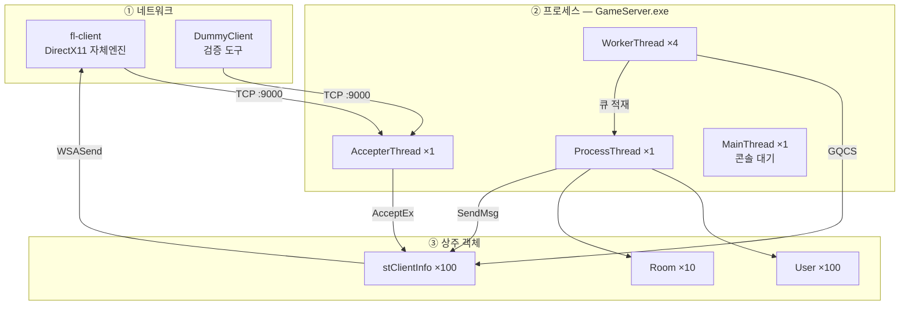
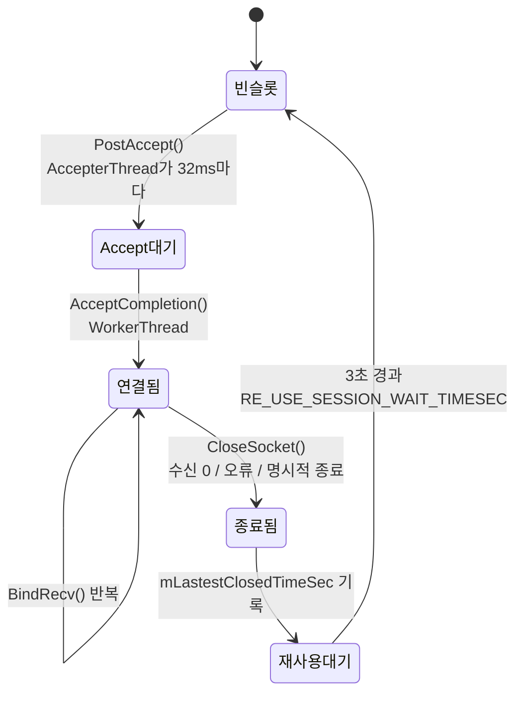
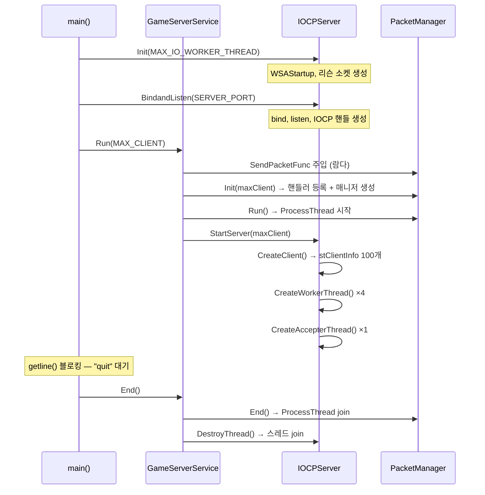
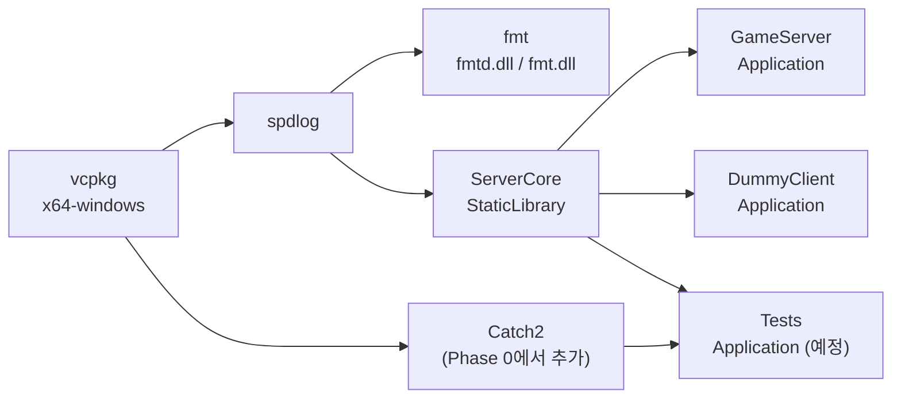
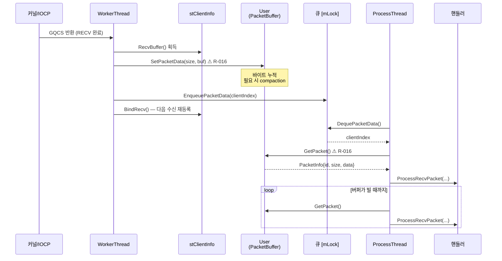
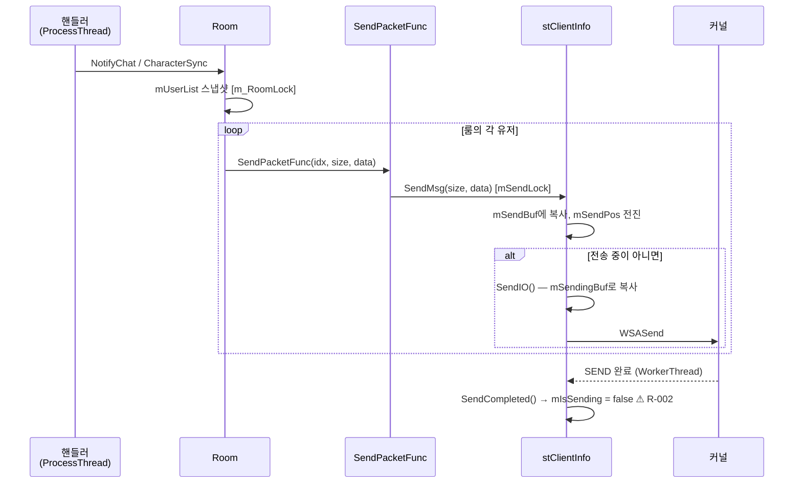
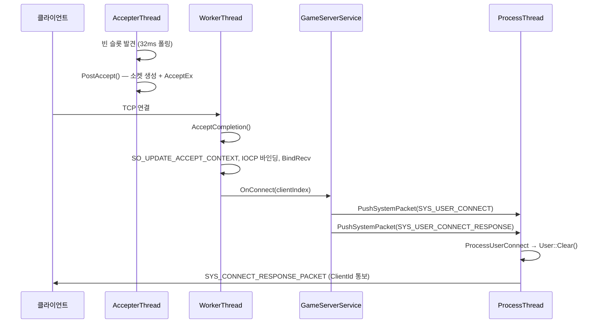

# 구성도

fl-server를 **네트워크 → 프로세스 → 빌드 → 폴더 → 파일 → 클래스 → 객체 → 스레드 → 메모리** 순서로 훑는다.
바깥에서 안으로 들어가는 순서이고, 각 층은 바로 위 층을 확대한 것이다.

> 이 문서는 **현재 상태**를 그린다. 왜 이렇게 되었는지는 [decisions.md](decisions.md),
> 무엇이 잘못되었는지는 [review-log.md](review-log.md), 흐름의 서술은 [architecture.md](architecture.md).
> 마지막 절 「결함 오버레이」에 R-번호를 구조 위에 얹어뒀다.

---

## 0. 계층 한 장 요약



| 층 | 단위 | 개수 | 어디서 정해지나 |
|---|---|---|---|
| 네트워크 | TCP 연결 | 최대 100 | `MAX_CLIENT` |
| 프로세스 | 실행 파일 | 1 (`GameServer.exe`) | 단일 프로세스 (D-001) |
| 스레드 | OS 스레드 | 7 | 1 main + 1 accepter + 4 worker + 1 process |
| 빌드 | vcxproj | 3 (+1 예정) | `fl-server.sln` |
| 클래스 | 주요 타입 | 9 | — |
| 객체 | 상주 인스턴스 | 210 | 전부 사전 할당 (D-002) |
| 메모리 | 상주 버퍼 | 약 7.3 MB | 아래 §9 |

---

## 1. 네트워크 계층

### 1.1 배포 토폴로지

현재는 **한 대에 전부**다. 분산 요소가 없다.

```
┌─────────────────────── 개발 PC (Windows 11 x64) ───────────────────────┐
│                                                                        │
│   ┌──────────────┐        ┌──────────────┐        ┌──────────────┐    │
│   │ fl-client    │        │ fl-client    │        │ DummyClient  │    │
│   │ (별도 저장소) │        │ (별도 저장소) │        │ (같은 저장소) │    │
│   └──────┬───────┘        └──────┬───────┘        └──────┬───────┘    │
│          │                       │                       │            │
│          └───────────────┬───────┴───────────────────────┘            │
│                          │  TCP / IPv4 / 127.0.0.1:9000               │
│                   ┌──────▼──────────┐                                  │
│                   │ GameServer.exe  │  ← 리슨 소켓 1개                  │
│                   └─────────────────┘                                  │
│                                                                        │
│   DB 없음 · 캐시 없음 · 로드밸런서 없음 · 계정서버 없음                    │
└────────────────────────────────────────────────────────────────────────┘
```

의도적으로 없는 것들은 [limits.md](limits.md)에 이유와 함께 있다.

### 1.2 소켓 구성

| 소켓 | 개수 | 만드는 곳 | 옵션 |
|---|---|---|---|
| 리슨 소켓 | 1 | `IOCPServer::Init` — `WSASocket(..., WSA_FLAG_OVERLAPPED)` | `listen(backlog=5)` |
| 접속 소켓 | 최대 100 | `stClientInfo::PostAccept` — 세션마다 **미리** 생성 | `SO_UPDATE_ACCEPT_CONTEXT` |

`stClientInfo::SetSocketOption()`이 `TCP_NODELAY`와 `SO_RCVBUF=0`을 설정하도록 작성되어
있으나 **아무 데서도 호출되지 않는다.** 즉 현재 Nagle 알고리즘이 켜져 있다.

### 1.3 프로토콜 스택

```
┌─────────────────────────────────────────┐
│ 애플리케이션  PACKET_HEADER(6B) + 바디    │  ← protocol.md
│               리틀 엔디언, pack(1) 바디   │
├─────────────────────────────────────────┤
│ 전송          TCP (경계 없음 → 재조립)     │  ← PacketBuffer가 담당
├─────────────────────────────────────────┤
│ 네트워크      IPv4                        │
└─────────────────────────────────────────┘
```

TLS 없음, 압축 없음, 버전 협상 없음.

### 1.4 연결 수명



**슬롯은 회수되지 않고 재사용된다.** 세대(generation) 값이 없어 이전 유저의 큐 항목이
새 유저에게 적용될 수 있다 (→ R-010).

---

## 2. 프로세스 / 프로그램 계층

### 2.1 프로그램 목록

| 프로그램 | 종류 | 산출물 | 역할 |
|---|---|---|---|
| `GameServer.exe` | Application | `Binary/$(Configuration)/` | **서버 본체.** 유일한 운영 프로세스 |
| `DummyClient.exe` | Application | `Binary/$(Configuration)/` | 검증 도구. 현재 빈 껍데기 (계획 Task 1.3에서 구현) |
| `ServerCore.lib` | StaticLibrary | `Libraries/$(Configuration)/` | 실행되지 않음. 위 둘에 링크됨 |
| `Tests.exe` | Application (예정) | — | 계획 Phase 0에서 신설 |

### 2.2 `GameServer.exe` 내부 스레드 구성

```
GameServer.exe (프로세스 1개)
│
├─ MainThread ────────────── main() → getline() 블로킹, "quit" 대기
│                            생성: CRT
│
├─ AccepterThread ×1 ─────── 32ms 주기 폴링
│                            생성: IOCPServer::CreateAccepterThread
│                            하는 일: 빈 슬롯 전부 순회 → PostAccept
│                            만지는 것: mClientInfos[] (연결 상태만)
│
├─ WorkerThread ×4 ───────── GetQueuedCompletionStatus(INFINITE)
│   (MAX_IO_WORKER_THREAD)   생성: IOCPServer::CreateWorkerThread
│                            하는 일: ACCEPT / RECV / SEND 완료 처리
│                            만지는 것: stClientInfo, ⚠ User::PacketBuffer
│
├─ ProcessThread ×1 ──────── 큐가 비면 1ms sleep
│                            생성: PacketManager::Run
│                            하는 일: 게임 로직 전부
│                            만지는 것: User, Room, *Manager
│
└─ SendThread ×0 ─────────── 구현되어 있으나 호출이 주석 처리됨 (D-004)
                             살아있다면: 8ms 주기로 전 세션 SendIO
```

### 2.3 프로세스 생명주기



> `DestroyThread()`는 `CloseHandle(mIOCPHandle)`을 워커 스레드가 아직 돌고 있는 동안
> 호출한다. in-flight I/O 완료를 기다리지 않는다 (→ limits.md).

---

## 3. 빌드 계층

### 3.1 프로젝트 의존 그래프



### 3.2 빌드 설정

| 항목 | 값 |
|---|---|
| 플랫폼 툴셋 | `v143` (Visual Studio 2022) |
| 언어 표준 | `stdcpp20` |
| 플랫폼 | x64 전용 |
| 구성 | Debug / Release |
| 패키지 관리 | vcpkg (`vcpkg integrate install` 방식, `vcpkg.json` 없음) |

### 3.3 산출물 경로

```
Libraries/
├── Debug/     ServerCore.lib, ServerCore.pdb, ServerCore.idb
└── Release/   ServerCore.lib, ServerCore.pdb

Binary/
├── Debug/     GameServer.exe, GameServer.pdb
│              DummyClient.exe, DummyClient.pdb
│              fmtd.dll          ← vcpkg가 복사
└── Release/   GameServer.exe, GameServer.pdb
               (fmt.dll)
```

중간 산출물은 각 프로젝트의 `x64/$(Configuration)/`에 남는다.
**둘 다 git에 추적되지 않는다** (표준 VS `.gitignore` 규칙이 덮는다).

### 3.4 링크 방식의 취약점

`DummyClient/pch.h`가 라이브러리를 **상대 경로로 하드코딩**한다.

```cpp
#ifdef _DEBUG
#pragma comment(lib, "Debug\\ServerCore.lib")
#else
#pragma comment(lib, "Release\\ServerCore.lib")
#endif
```

프로젝트 참조가 아니라 pragma + 라이브러리 검색 경로에 의존한다. `GameServer`는 어떻게
링크되는지 별도 확인이 필요하다. 구성 이름이 바뀌거나 출력 경로가 바뀌면 조용히 깨진다.

---

## 4. 폴더 구조

```
D:\Source\fl-server\
│
├── fl-server.sln ......................... 솔루션 (프로젝트 3개)
│
├── AGENTS.md ............................. ⛔ AI 규칙 정본 (모든 도구)
├── CLAUDE.md ............................. Claude Code용 포인터
├── .github/
│   └── copilot-instructions.md ........... GitHub Copilot용 포인터
├── .gitignore ............................ ⚠ 다른 프로젝트에서 복사됨 (§4.1)
│
├── ServerCore/ ........................... [정적 lib] 소켓 I/O 전용
│   ├── ServerCore.vcxproj
│   ├── pch.h / CorePch.h / CorePch.cpp ... 전처리 헤더, 전역 include
│   ├── Types.h ........................... 타입 별칭 (현재 미사용)
│   ├── Define.h .......................... 전역 상수
│   ├── Server_Defines.h .................. Server_Function.h만 포함
│   ├── Server_Function.h ................. MakePacketBuffer<T>
│   ├── Enums.h ........................... Enum_* 4개 묶음
│   ├── Enum_IOOperation.h ................ ACCEPT / RECV / SEND
│   ├── Enum_ErrorCode.h .................. ERROR_CODE
│   ├── Enum_PacketId.h ................... PACKET_ID
│   ├── Enum_DomainState.h ................ NONE / LOGIN / ROOM
│   ├── OverlappedEx.h .................... stOverlappedEx
│   ├── IOCPServer.h/.cpp ................. IOCP 루프, 스레드, 세션 풀
│   ├── ClientInfo.h/.cpp ................. stClientInfo — 연결 1개
│   ├── PacketHeader.h .................... PACKET_HEADER (6바이트)
│   ├── PacketInfo.h ...................... PacketInfo — 내부 전달용
│   ├── PacketBuffer.h/.cpp ............... TCP 스트림 → 패킷 경계
│   ├── Packet.h/.cpp ..................... PacketData — ⚠ 미사용
│   └── Sys_ConnectResponsePacket.h ....... SYS_CONNECT_RESPONSE_PACKET
│
├── GameServer/ ........................... [exe] 게임 로직
│   ├── GameServer.vcxproj
│   ├── pch.h / pch.cpp
│   ├── GameServer.cpp .................... main()
│   ├── GameServerService.h/.cpp .......... IOCPServer 상속, 어댑터
│   ├── PacketManager.h/.cpp .............. 디스패치 + 핸들러 전부 (336줄)
│   ├── User.h/.cpp ....................... 유저 1명의 세션 스코프 상태
│   ├── UserManager.h/.cpp ................ User 풀, ID 사전
│   ├── Room.h/.cpp ....................... 룸 1개, 브로드캐스트
│   ├── RoomManager.h/.cpp ................ Room 풀
│   ├── Packet_GamesServer.h .............. Packet_* 묶음 헤더
│   ├── Packet_Login.h .................... LOGIN_*
│   ├── Packet_Room.h ..................... ROOM_ENTER/LEAVE/JOIN
│   ├── Packet_RoomChat.h ................. ROOM_CHAT_*
│   └── Packet_CharacterSync.h ............ CHARACTER_SYNC_PACKET
│
├── DummyClient/ .......................... [exe] ⚠ 현재 빈 껍데기
│   ├── DummyClient.vcxproj
│   ├── pch.h ............................. ServerCore.lib 상대경로 링크
│   └── DummyClient.cpp ................... main()이 ServerCore() 스텁만 호출
│
├── docs/
│   ├── wiki/
│   │   ├── README.md ..................... 색인 + 협업 규칙
│   │   ├── architecture.md ............... 스레드·흐름 서술
│   │   ├── protocol.md ................... 와이어 계약
│   │   ├── structure.md .................. ← 이 문서
│   │   ├── decisions.md .................. 결정·버린 대안·반려 [원장]
│   │   ├── review-log.md ................. 검토 이력 R-001~R-017 [원장]
│   │   └── limits.md ..................... 한계 스냅샷
│   └── superpowers/plans/
│       └── 2026-08-23-correctness-foundation.md  Phase 0–2 실행 계획
│
├── Libraries/ ............................ [빌드 산출물] ServerCore.lib
├── Binary/ ............................... [빌드 산출물] *.exe
├── backup/ ............................... ⚠ 이전 단일 프로젝트 구조 잔재
│   ├── default/ .......................... 옛 fl-server.vcxproj
│   ├── includes/ ......................... 옛 헤더 (PacketId.h 등)
│   ├── src/ .............................. 옛 소스 (EchoServer, ChatServer)
│   └── bin/ .............................. 옛 실행 파일
│
└── .vs/ .................................. Visual Studio 로컬 캐시
```

### 4.1 폴더 관련 관찰

| 관찰 | 내용 |
|---|---|
| `.gitignore`가 남의 것 | `Resources/`, `Client/Bin/`, `Editor/Bin/`, `Engine/Bin/`, `EngineSDK/` 규칙이 있다. **DirectX11 클라이언트 저장소에서 복사됐다.** 이 저장소엔 그런 폴더가 없다. 뒷부분의 표준 VS 규칙이 빌드 산출물을 덮어주므로 동작에는 문제가 없다 |
| `backup/`이 추적 안 됨 | git에 없다. 리팩터링 전 구조의 로컬 사본. `EchoServer` / `ChatServer` 같은 지금은 없는 코드가 들어있다 |
| 추적 파일 57개 | 소스와 프로젝트 파일만. 산출물은 전부 제외됨 |
| `Packet.h/.cpp`가 미사용 | `PacketData` 구조체를 아무도 쓰지 않는다. `PacketInfo`가 그 역할을 한다 |
| `Types.h`가 미사용 | `int32`/`uint32` 별칭이 있으나 코드는 `INT32`/`UINT32`를 쓴다 |

---

## 5. 파일별 책임과 규모

### 5.1 ServerCore (총 1,110줄)

| 파일 | 줄 | 책임 | 상태 |
|---|---|---|---|
| `IOCPServer.cpp` | 321 | 스레드 3종, IOCP 루프, 세션 풀 관리 | |
| `ClientInfo.cpp` | 259 | 연결 1개의 I/O — accept/recv/send | R-001 R-002 R-011 R-014 |
| `PacketBuffer.cpp` | 82 | 스트림 → 패킷 경계 복원 | R-016 R-017 |
| `ClientInfo.h` | 73 | | |
| `IOCPServer.h` | 69 | | |
| `CorePch.h` | 58 | 전역 include + `using namespace std` | |
| `Enum_PacketId.h` | 37 | | |
| `Enum_ErrorCode.h` | 31 | | |
| `Packet.cpp` / `Packet.h` | 25/19 | `PacketData` | **미사용** |
| `PacketBuffer.h` | 21 | | |
| `Define.h` | 17 | 전역 상수 7개 | |
| `Sys_ConnectResponsePacket.h` | 12 | | |
| `PacketInfo.h` | 12 | | |
| `Server_Function.h` | 11 | `MakePacketBuffer<T>` | |
| `PacketHeader.h` | 11 | | R-012 |
| `Types.h` | 10 | | **미사용** |
| `Enum_IOOperation.h` | 10 | | |
| `Enum_DomainState.h` | 10 | | |
| `OverlappedEx.h` | 9 | | |
| `Enums.h` | 6 | | |

### 5.2 GameServer (총 1,061줄)

| 파일 | 줄 | 책임 | 상태 |
|---|---|---|---|
| `PacketManager.cpp` | 336 | **핸들러 전부 + 디스패치 + ProcessThread** | R-003 R-005 R-006 R-009 R-015 |
| `Room.cpp` | 133 | 브로드캐스트, 입퇴장 | R-004 R-007 R-013 |
| `PacketManager.h` | 73 | | |
| `GameServerService.cpp` | 55 | ServerCore ↔ GameServer 어댑터 | |
| `RoomManager.cpp` | 53 | | |
| `UserManager.cpp` | 47 | | R-003 R-008 |
| `User.h` / `User.cpp` | 43/43 | | R-003 R-007 |
| `Room.h` | 39 | | |
| `UserManager.h` | 36 | | R-008 |
| `Packet_Room.h` | 35 | | R-012 |
| `RoomManager.h` | 30 | | |
| `GameServer.cpp` | 29 | `main()` | R-011 |
| `Packet_RoomChat.h` | 23 | | R-012 |
| `Packet_CharacterSync.h` | 22 | | R-012 |
| `GameServerService.h` | 21 | | |
| `Packet_Login.h` | 19 | | R-012 |

**`PacketManager.cpp`가 전체의 15%다.** 모든 게임 로직이 여기 있다.

---

## 6. 클래스 관계도

```mermaid
classDiagram
    class IOCPServer {
        <<abstract>>
        -vector~shared_ptr~stClientInfo~~ mClientInfos
        -SOCKET mListenSocket
        -HANDLE mIOCPHandle
        -vector~thread~ mIOWorkerThreads
        -thread mAccepterThread
        -thread mSendThread
        +Init(maxIOWorkerThreadCount)
        +BindandListen(port)
        +StartServer(maxClientCount)
        +SendMsg(sessionIndex, size, data)
        +OnConnect(clientIndex)*
        +OnClose(clientIndex)*
        +OnReceive(clientIndex, size, data)*
    }

    class stClientInfo {
        -INT32 mIndex
        -SOCKET mSocket
        -stOverlappedEx mAcceptContext
        -stOverlappedEx mRecvOverlappedEx
        -stOverlappedEx mSendOverlappedEx
        -shared_ptr~char[]~ mRecvBuf
        -char mSendBuf[4096]
        -char mSendingBuf[4096]
        -mutex mSendLock
        -atomic~bool~ mIsSending
        +PostAccept() bool
        +AcceptCompletion() bool
        +BindRecv() bool
        +SendMsg(size, data) bool
        +SendIO() bool
        +SendCompleted(size)
    }

    class PacketBuffer {
        -UINT32 mPacketDataBufferWPos
        -UINT32 mPacketDataBufferRPos
        -shared_ptr~char[]~ mPacketDataBuffer
        +Init(bufferSize)
        +SetPacketData(size, data)
        +GetPacket() PacketInfo
        +Clear()
    }

    class GameServerService {
        -unique_ptr~PacketManager~ m_pPacketManager
        +Run(maxClient)
        +End()
        +OnConnect(clientIndex)
        +OnClose(clientIndex)
        +OnReceive(clientIndex, size, data)
    }

    class PacketManager {
        -unordered_map~int,FUNC~ mRecvFunctionDictionary
        -unique_ptr~UserManager~ mUserManager
        -unique_ptr~RoomManager~ mRoomManager
        -deque~UINT32~ mInComingPacketUserIndex
        -deque~PacketInfo~ mSystemPacketQueue
        -mutex mLock
        -thread mProcessThread
        +function SendPacketFunc
        +ReceivePacketData(clientIndex, size, data)
        +PushSystemPacket(packet)
        -ProcessPacket()
        -ProcessRecvPacket(...)
    }

    class UserManager {
        -vector~shared_ptr~User~~ mUserObjPool
        -unordered_map~string,int~ mUserIDDictionary
        +AddUser(userID, clientIndex)
        +FindUserIndexByID(userID) INT32
        +DeleteUserInfo(user)
        +GetUserByConnIdx(clientIndex) shared_ptr~User~
    }

    class User {
        -INT32 mIndex
        -INT32 mRoomIndex
        -string mUserID
        -string mAuthToken
        -DOMAIN_STATE mCurDomainState
        -PacketBuffer mPacketBuffer
        +SetLogin(userID)
        +EnterRoom(roomIndex)
        +SetPacketData(size, data)
        +GetPacket() PacketInfo
        +Clear()
    }

    class RoomManager {
        -vector~shared_ptr~Room~~ mRoomList
        -INT32 mBeginRoomNumber
        -INT32 mEndRoomNumber
        +function SendPacketFunc
        +EnterUser(roomNumber, user)
        +LeaveUser(roomNumber, user)
        +GetRoomByNumber(number) shared_ptr~Room~
    }

    class Room {
        -INT32 mRoomNum
        -list~shared_ptr~User~~ mUserList
        -INT32 mMaxUserCount
        -mutex m_RoomLock
        +function SendPacketFunc
        +EnterUser(user) INT16
        +LeaveUser(user)
        +NotifyChat(clientIndex, userID, msg)
        +NotifyNewGuest(clientIndex, userID)
        +CharacterSync(clientIndex, data)
        -SendToAllUser(...)
    }

    IOCPServer <|-- GameServerService : 상속
    IOCPServer "1" *-- "100" stClientInfo : 소유
    GameServerService "1" *-- "1" PacketManager : 소유 (unique_ptr)
    PacketManager "1" *-- "1" UserManager : 소유 (unique_ptr)
    PacketManager "1" *-- "1" RoomManager : 소유 (unique_ptr)
    UserManager "1" *-- "100" User : 소유 (풀)
    RoomManager "1" *-- "10" Room : 소유 (풀)
    User "1" *-- "1" PacketBuffer : 값 멤버
    Room "1" o-- "0..4" User : 참조만 (소유 아님)
```



### 6.1 소유권 규칙

| 관계 | 종류 | 의미 |
|---|---|---|
| `IOCPServer` → `stClientInfo` | **소유** | `vector<shared_ptr>`, 시작 시 100개 생성 |
| `UserManager` → `User` | **소유** | `vector<shared_ptr>`, 시작 시 100개 생성 |
| `RoomManager` → `Room` | **소유** | `vector<shared_ptr>`, 시작 시 10개 생성 |
| `Room` → `User` | **참조** | `list<shared_ptr>`이지만 실소유자는 `UserManager` (I-5) |
| `User` → `PacketBuffer` | **값 멤버** | 유저마다 64KB 버퍼 하나 |

**어떤 객체도 런타임에 해제되지 않는다** (I-4). `Clear()`로 초기화될 뿐이다.

### 6.2 계층 경계

```
        ┌───────────── GameServer (게임을 안다) ─────────────┐
        │  GameServerService  PacketManager  User  Room ...  │
        └───────────┬──────────────────────────▲─────────────┘
                    │ OnConnect                │ SendMsg
                    │ OnReceive                │
                    │ OnClose                  │
        ┌───────────▼──────────────────────────┴─────────────┐
        │  IOCPServer  stClientInfo  PacketBuffer            │
        └───────────── ServerCore (게임을 모른다) ────────────┘
```

**경계는 순수가상 3개 + `SendMsg` 하나, 총 4개뿐이다** (I-8). 이 경계는 잘 지켜지고 있다.

### 6.3 콜백 배선

`std::function` 하나가 세 번 복사되며 내려간다.

```
GameServerService::Run()
  └─ 람다 [&](clientIndex, size, data) { SendMsg(...); }
       │
       ├─→ PacketManager::SendPacketFunc          function<void(UINT32, UINT32, shared_ptr<char[]>)>
       │        └─ 핸들러들이 직접 호출
       │
       └─→ RoomManager::SendPacketFunc            function<void(UINT32, UINT16, shared_ptr<char[]>)>  ← 타입 다름
                └─ RoomManager::Init()에서 각 Room에 복사
                     └─→ Room::SendPacketFunc     function<void(UINT32, UINT32, shared_ptr<char[]>)>
```

> **타입 불일치**: `RoomManager::SendPacketFunc`는 두 번째 인자가 `UINT16`인데
> `PacketManager`와 `Room`은 `UINT32`다. 암묵 변환으로 컴파일되며 현재 모든 패킷이
> 65,536바이트 미만이라 문제가 드러나지 않는다. 의도된 것으로 보이지 않는다.

---

## 7. 런타임 객체 인스턴스 맵

서버가 뜬 직후 존재하는 것 전부.

```
GameServer.exe
│
├── GameServerService ×1            (스택, main의 지역변수)
│   │
│   ├── [IOCPServer 부분]
│   │   ├── mListenSocket ×1
│   │   ├── mIOCPHandle ×1
│   │   ├── mClientInfos ────────── stClientInfo ×100
│   │   │                            ├── mRecvBuf(256B) ×100      [힙]
│   │   │                            ├── mSendBuf(4KB) ×100       [객체 내부]
│   │   │                            ├── mSendingBuf(4KB) ×100    [객체 내부]
│   │   │                            └── stOverlappedEx ×300      (세션당 3개)
│   │   ├── mIOWorkerThreads ×4
│   │   └── mAccepterThread ×1
│   │
│   └── m_pPacketManager ×1
│       ├── mProcessThread ×1
│       ├── mInComingPacketUserIndex   deque<UINT32>     (가변)
│       ├── mSystemPacketQueue         deque<PacketInfo> (가변)
│       ├── mRecvFunctionDictionary    항목 9개
│       │
│       ├── mUserManager ×1
│       │   ├── mUserObjPool ───────── User ×100
│       │   │                           └── mPacketBuffer ×100
│       │   │                                └── 버퍼(64KB) ×100  [힙]
│       │   └── mUserIDDictionary      map<string,int> (가변, 로그인 수만큼)
│       │
│       └── mRoomManager ×1
│           └── mRoomList ───────────── Room ×10
│                                        └── mUserList  list<shared_ptr<User>> (0~4)
│
└── 총 상주 객체: 210개 + 스레드 7개
```

| 타입 | 개수 | 결정 위치 |
|---|---|---|
| `stClientInfo` | 100 | `MAX_CLIENT` (`Define.h`) |
| `User` | 100 | `MAX_CLIENT` → `PacketManager::CreateComponent` |
| `PacketBuffer` | 100 | `User`의 값 멤버 |
| `Room` | 10 | `PacketManager::CreateComponent` **하드코딩** |
| `stOverlappedEx` | 300 | 세션당 accept/recv/send 3개 |
| 매니저 | 2 | `UserManager`, `RoomManager` |

---

## 8. 스레드 소유권 맵

**이 문서에서 가장 중요한 표다.** 어느 스레드가 어느 객체를 만지는가.

| 객체 / 필드 | Main | Accepter | Worker ×4 | Process | 보호 |
|---|:---:|:---:|:---:|:---:|---|
| `mListenSocket` | 생성 | 읽기 | 읽기 | — | 없음 (읽기 전용) |
| `mClientInfos[]` (컨테이너) | 생성 | 읽기 | 읽기 | 읽기 | 없음 (크기 불변) |
| `stClientInfo::mIsConnect` | — | 읽기 | 쓰기 | — | 없음 |
| `stClientInfo::mSocket` | — | 쓰기 | 읽기/쓰기 | 읽기 | 없음 |
| `stClientInfo::mRecvBuf` | — | — | 쓰기(WSARecv) | — | 없음 (세션당 1스레드) |
| `stClientInfo::mSendBuf` | — | — | — | 쓰기 | `mSendLock` |
| `stClientInfo::mSendingBuf` | — | — | 읽기(in-flight) | 쓰기 | ⚠ 부분 |
| `stClientInfo::mIsSending` | — | — | **쓰기 (락 없이)** | 읽기/쓰기 (락 안) | ⚠ **R-002** |
| `PacketManager::mInComingPacketUserIndex` | — | — | 쓰기 | 읽기 | `mLock` ✅ |
| `PacketManager::mSystemPacketQueue` | — | — | 쓰기 | 읽기 | `mLock` ✅ |
| **`User::mPacketBuffer`** | — | — | **쓰기** | **읽기/쓰기** | ⚠ **없음 → R-016** |
| `User` 나머지 필드 | — | — | — | 읽기/쓰기 | 없음 (단일 스레드 OK) |
| `UserManager::mUserIDDictionary` | — | — | — | 읽기/쓰기 | 없음 (단일 스레드 OK) |
| `Room::mUserList` | — | — | — | 읽기/쓰기 | `m_RoomLock` (불필요 → R-013) |

### 8.1 의도한 규칙 vs 실제

```
        의도 (I-1, I-2)                     실제
   ┌──────────────────────┐        ┌──────────────────────┐
   │ WorkerThread         │        │ WorkerThread         │
   │   소켓 I/O만         │        │   소켓 I/O           │
   │   큐에 넣기만        │        │   큐에 넣기          │
   └──────────┬───────────┘        │   + User::PacketBuffer│ ⚠
              │ 큐 (락 있음)        │     에 직접 쓰기      │
   ┌──────────▼───────────┐        └──────────┬───────────┘
   │ ProcessThread        │                   │ 락 없는 공유
   │   게임 상태 전부      │        ┌──────────▼───────────┐
   └──────────────────────┘        │ ProcessThread        │
                                   │   같은 버퍼를 읽음    │ ⚠ R-016
                                   └──────────────────────┘
```

**불변식 I-2가 코드로 강제되지 않아서 깨졌다.** 이게 위키에 불변식을 적어둔 이유이고,
그 불변식을 `assert`나 구조로 옮겨야 하는 이유다.

---

## 9. 메모리 레이아웃

### 9.1 세션 하나(`stClientInfo`)의 구성

```
stClientInfo  ≈ 8.5 KB
┌────────────────────────────────────────────────┐
│ mIndex(4) mIOCPHandle(8) mIsConnect(8)         │
│ mLastestClosedTimeSec(8)                       │
│ mSocket(8) mListenSocket(8)                    │
├────────────────────────────────────────────────┤
│ mAcceptContext      stOverlappedEx    56 B     │
│ mAcceptBuf[64]                        64 B     │
│ mRecvOverlappedEx   stOverlappedEx    56 B     │
│ mSendOverlappedEx   stOverlappedEx    56 B     │
├────────────────────────────────────────────────┤
│ mRecvBuf            shared_ptr → [힙 256 B]    │
├────────────────────────────────────────────────┤
│ mSendLock           mutex            ~80 B     │
│ mIsSending          atomic<bool>       1 B     │
│ mSendPos            UINT64             8 B     │
│ mSendBuf[4096]                      4,096 B    │  ← 축적용
│ mSendingBuf[4096]                   4,096 B    │  ← in-flight용
└────────────────────────────────────────────────┘

stOverlappedEx = WSAOVERLAPPED(32) + WSABUF(16) + enum(4) + UINT32(4) = 56 B
```

### 9.2 유저 하나(`User`)의 구성

```
User  ≈ 120 B + 힙 64 KB
┌────────────────────────────────────────────────┐
│ mIndex(4) mRoomIndex(4)                        │
│ mUserID       string      ~40 B                │
│ mAuthToken    string      ~40 B  ← 미사용      │
│ mIsConfirm    bool          1 B  ← 미사용      │
│ mCurDomainState             4 B                │
│ mPacketBuffer                                  │
│   ├ WPos(4) RPos(4)                            │
│   └ shared_ptr → [힙 65,536 B]                 │
└────────────────────────────────────────────────┘
```

### 9.3 총 상주 메모리

| 항목 | 단가 | 개수 | 소계 |
|---|---:|---:|---:|
| `stClientInfo` 본체 | 8.5 KB | 100 | 850 KB |
| `mRecvBuf` (힙) | 256 B | 100 | 25 KB |
| `User` 본체 | 120 B | 100 | 12 KB |
| `PacketBuffer` 버퍼 (힙) | 64 KB | 100 | **6,400 KB** |
| `Room` | ~200 B | 10 | 2 KB |
| | | **합계** | **≈ 7.3 MB** |

**전체의 88%가 유저별 64KB 패킷 조립 버퍼다.** 수신 버퍼가 256바이트인데
조립 버퍼가 64KB인 것은 균형이 맞지 않는다 (→ decisions.md 열린 질문).

### 9.4 버퍼 크기 관계

```
        수신 경로                                  송신 경로
   ┌─────────────────┐                      ┌─────────────────┐
   │ 커널 소켓 버퍼   │                      │ mSendBuf 4 KB   │ ← 축적
   └────────┬────────┘                      └────────┬────────┘
            │ WSARecv 최대 256 B                     │ 복사
   ┌────────▼────────┐                      ┌────────▼────────┐
   │ mRecvBuf 256 B  │  MAX_SOCKBUF         │ mSendingBuf 4KB │ ← in-flight
   └────────┬────────┘                      └────────┬────────┘
            │ CopyMemory                             │ WSASend
   ┌────────▼────────┐                      ┌────────▼────────┐
   │ PacketBuffer    │  64 KB               │ 커널 소켓 버퍼   │
   │ 64 KB           │  PACKET_DATA_BUFFER  └─────────────────┘
   └─────────────────┘
```

> `ROOM_CHAT_NOTIFY`가 296바이트다. `MAX_SOCKBUF`가 256이므로
> **채팅 알림은 항상 두 번에 나눠 수신된다.** 조립이 필수인 이유.
> 송신 쪽은 4KB / 296B ≈ 채팅 14개면 버퍼가 찬다 (→ R-001).

---

## 10. 데이터 흐름

### 10.1 수신 — 패킷 하나가 핸들러에 닿기까지



**큐에는 패킷이 아니라 유저 인덱스만 들어간다** (D-005). 그 대가가 R-016이다.

### 10.2 송신 — 브로드캐스트



**같은 `shared_ptr<char[]>`를 룸 인원 수만큼 `SendMsg`에 넘긴다.**
각 세션이 자기 `mSendBuf`로 복사하므로 데이터는 공유되지만 버퍼는 분리된다.

### 10.3 접속 → 첫 응답



---

## 11. 상태 기계

### 11.1 유저 도메인 상태

```mermaid
stateDiagram-v2
    [*] --> NONE: 접속 / User::Clear()
    NONE --> LOGIN: LOGIN_REQUEST 성공<br/>User::SetLogin()
    LOGIN --> ROOM: ROOM_ENTER_REQUEST 성공<br/>User::EnterRoom()
    ROOM --> LOGIN: ROOM_LEAVE_REQUEST<br/>RoomManager::LeaveUser()
    LOGIN --> NONE: 연결 종료
    ROOM --> NONE: 연결 종료<br/>(룸 퇴장 후 삭제)
    NONE --> [*]
```

| 상태 | 값 | 이 상태에서 유효한 패킷 (**현재 미검증** → R-009) |
|---|---|---|
| `NONE` | 0 | `LOGIN_REQUEST` |
| `LOGIN` | 1 | `ROOM_ENTER_REQUEST` |
| `ROOM` | 2 | `ROOM_LEAVE_REQUEST`, `ROOM_CHAT_REQUEST`, `CHARACTER_SYNC` |

### 11.2 종료 시 정리 순서

```
CloseSocket()
  └─ stClientInfo::Close()      소켓 종료, mIsConnect = 0, 종료 시각 기록
  └─ OnClose(clientIndex)
       └─ PushSystemPacket(SYS_USER_DISCONNECT)
            └─ [ProcessThread] ClearConnectionInfo()
                 ├─ 상태가 ROOM 이면 → RoomManager::LeaveUser()
                 │                        └─ Room::LeaveUser() → 남은 유저에게 통지
                 └─ 상태가 NONE 이 아니면 → UserManager::DeleteUserInfo()
                                             ├─ mUserIDDictionary.erase()
                                             └─ User::Clear()
```

---

## 12. 패킷 맵

```
PACKET_ID 대역
  0 ─────────────── 10   (미사용)
 11 ── SYS ──────── 30   시스템. 서버가 스스로 생성
 31 ─────────────── 199  (미사용, DB_END = 199)
201 ── LOGIN ────── 202
206 ── ROOM ENTER ─ 207
215 ── ROOM LEAVE ─ 216
221 ── CHAT ─────── 223
231 ── NOTIFY ───── 232
1001 ─ SYNC ─────── 1002
```

| ID | 이름 | 방향 | 크기 | 핸들러 |
|---:|---|:---:|---:|---|
| 11 | `SYS_USER_CONNECT` | 내부 | — | `ProcessUserConnect` |
| 12 | `SYS_USER_DISCONNECT` | 내부 | — | `ProcessUserDisConnect` |
| 13 | `SYS_USER_CONNECT_RESPONSE` | S→C | 10 | `ProcessSysUserConnectResponse` |
| 201 | `LOGIN_REQUEST` | C→S | 72 | `ProcessLogin` |
| 202 | `LOGIN_RESPONSE` | S→C | 8 | ⚠ `ProcessLogin`에도 등록됨 (R-006) |
| 206 | `ROOM_ENTER_REQUEST` | C→S | 10 | `ProcessEnterRoom` |
| 207 | `ROOM_ENTER_RESPONSE` | S→C | 8 | — |
| 215 | `ROOM_LEAVE_REQUEST` | C→S | 6 | `ProcessLeaveRoom` |
| 216 | `ROOM_LEAVE_RESPONSE` | S→C | 8 | — |
| 221 | `ROOM_CHAT_REQUEST` | C→S | 263 | `ProcessRoomChatMessage` |
| 222 | `ROOM_CHAT_RESPONSE` | S→C | 8 | — |
| 223 | `ROOM_CHAT_NOTIFY` | S→C | 296 | — |
| 231 | `ROOM_JOIN_NOTIFY` | S→C | 43 | — |
| 232 | `ROOM_LEAVE_NOTIFY` | S→C | 10 | — |
| 1001 | `CHARACTER_SYNC` | C→S | 42 | `ProcessCharacterSync` |
| 1002 | `CHARACTER_SYNC_BROADCAST` | S→C | 42 | — |

크기는 계산값이다. 계획 Task 0.8에서 `static_assert`로 확정한다.
상세는 [protocol.md](protocol.md).

---

## 13. 헤더 의존 구조

```
                    ┌──────────────┐
                    │ <windows.h>  │
                    │ <winsock2.h> │
                    │ spdlog       │  ← vcpkg
                    └──────┬───────┘
                           │
                    ┌──────▼───────┐
                    │  CorePch.h   │  전역 include + using namespace std
                    └──┬────┬───┬──┘
           ┌───────────┘    │   └────────────┐
    ┌──────▼──────┐  ┌──────▼──────┐  ┌──────▼─────────┐
    │ Server_     │  │  Define.h   │  │   Enums.h      │
    │ Defines.h   │  │  (상수)     │  └──┬──┬──┬──┬────┘
    └──────┬──────┘  └─────────────┘     │  │  │  │
    ┌──────▼──────┐              Enum_IOOperation  Enum_ErrorCode
    │ Server_     │              Enum_PacketId     Enum_DomainState
    │ Function.h  │
    │ MakePacket  │
    │ Buffer<T>   │
    └─────────────┘

    ┌──────────────┐
    │ PacketHeader │◄────┬── Sys_ConnectResponsePacket.h
    │      .h      │     ├── Packet_Login.h      ┐
    └──────────────┘     ├── Packet_Room.h       ├─ Packet_GamesServer.h
                         ├── Packet_RoomChat.h   │
                         └── Packet_CharacterSync.h ┘

    ┌──────────────┐     ┌──────────────┐
    │ PacketInfo.h │◄────│ PacketBuffer │◄──── User.h
    └──────────────┘     │     .h       │
                         └──────────────┘
```

**주목:** `PACKET_HEADER`만 `#pragma pack`이 없고 파생 패킷은 전부 `pack(1)`이다.
헤더 6바이트(패딩 1 포함) + 무패딩 바디의 하이브리드 레이아웃 (I-7, R-012).

---

## 14. 결함 오버레이

구조 위에 [review-log.md](review-log.md)의 R-번호를 얹은 지도.

```
┌─ 네트워크 ────────────────────────────────────────────────────┐
│                                                               │
│  세션 슬롯 재사용 (3초)  ── R-010 세대값 없음 → 패킷 오배달     │
│                                                               │
├─ ServerCore ──────────────────────────────────────────────────┤
│                                                               │
│  IOCPServer::WorkerThread ── R-011 바이너리를 문자열로 로깅     │
│                                                               │
│  stClientInfo::SendMsg ───── R-001 미전송 데이터 덮어쓰기       │
│  stClientInfo::SendIO ────── R-002 mIsSending 레이스           │
│  stClientInfo::SendCompleted ─┘  (락 도메인 불일치)            │
│  stClientInfo::AcceptCompletion ─ R-014 초기화 안 된 주소 로깅  │
│                                                               │
│  PacketBuffer ───────────── R-016 두 스레드 무보호 공유 ★      │
│  PacketBuffer::GetPacket ── R-017 PacketLength 하한 미검증 ★   │
│                                                               │
│  PACKET_HEADER ──────────── R-012 크기가 암묵적                │
│                                                               │
├─ GameServer ──────────────────────────────────────────────────┤
│                                                               │
│  PacketManager::Init ────── R-006 LOGIN_RESPONSE 수신 등록     │
│  PacketManager::ProcessRecvPacket ─ R-005 크기 미검증 ★        │
│                                    R-009 상태 미검증           │
│  PacketManager::ProcessLogin ───── R-003 UserID 1바이트 복사 ★ │
│  PacketManager::CreateComponent ── R-015 룸 설정 하드코딩      │
│                                                               │
│  UserManager ────────────── R-008 카운터가 죽은 코드           │
│                                                               │
│  Room::LeaveUser ────────── R-004 10B 버퍼를 43B로 전송 ★      │
│  Room::NotifyChat ───────── R-007 짧은 문자열 33B 고정 복사     │
│  Room::m_RoomLock ───────── R-013 아무것도 지키지 않음          │
│                                                               │
└───────────────────────────────────────────────────────────────┘
                                                    ★ = 치명
```

### 14.1 결함 밀도

| 영역 | 줄 수 | 결함 | 밀도 |
|---|---:|---:|---|
| `stClientInfo` (송신 경로) | ~80 | 4 | 가장 높음 |
| `PacketManager` (디스패치·핸들러) | 336 | 5 | 높음 |
| `Room` | 133 | 3 | 높음 |
| `PacketBuffer` | 82 | 2 | 높음 (둘 다 치명) |
| `IOCPServer` | 321 | 1 | 낮음 |
| `UserManager` / `User` | 90 | 2 | 보통 |

**송신 경로와 신뢰 경계에 몰려 있다.** 접속 관리(IOCP 루프)는 상대적으로 건강하다.

---

## 15. 목표 구조 (요약)

**전체 목표 구성도는 [target-structure.md](target-structure.md)에 있다.**
이 절 번호와 맞춰 놨으니 같은 번호끼리 나란히 보면 된다.

아래는 한 장 요약이다. 아직 결정되지 않았고 **답변 대기 중인 질문에 달려 있다**
(→ decisions.md 열린 질문).

```
현재                                   목표 (D-003 → D-010 예정)

WorkerThread ×4                        WorkerThread ×4
   └─ User::PacketBuffer에 직접 쓰기 ⚠      └─ stClientInfo::PacketBuffer (전용)
        │                                        │ 완성된 패킷만
        ▼ 인덱스 큐                              ▼ 패킷 큐
ProcessThread ×1                       룸 워커 풀 ×N
   └─ 모든 룸의 로직                        └─ 한 룸은 한 워커만 (소유권)
   └─ 1ms sleep 폴링                        └─ 고정 틱 (예: 30Hz)
   └─ Room::m_RoomLock (무의미)             └─ 락 없음
```

| 변경 | 해소되는 것 | 전제 조건 |
|---|---|---|
| 조립을 `stClientInfo`로 이동 | R-016, I-2가 구조로 성립 | Phase 4 |
| 세션 generation 도입 | R-010 | Phase 4 |
| 송신 링버퍼 + pending 큐 | R-001, R-002 | **D-004 답변 필요** |
| 룸 액터 + 틱 | R-013, 틱 부재 | **게임 종류 확정 필요** |
| 룸 설정 외부화 | R-015 | Phase 5 |

---

## 이 문서 유지 규칙

- **구조를 바꾼 커밋은 이 문서도 같은 커밋에서 고친다.** 구성도가 코드보다 뒤처지는
  순간부터 이 문서는 거짓말을 시작한다.
- 개수(100/10/4)와 크기(4KB/64KB/296B)는 코드에서 온 값이다. 상수를 바꾸면 여기도 바꾼다.
- §14 결함 오버레이는 [review-log.md](review-log.md)를 따라간다. 항목이 `해결`이 되면 여기서도 지운다.
- **줄 번호를 쓰지 않는다.** 심볼 이름으로만 가리킨다.
