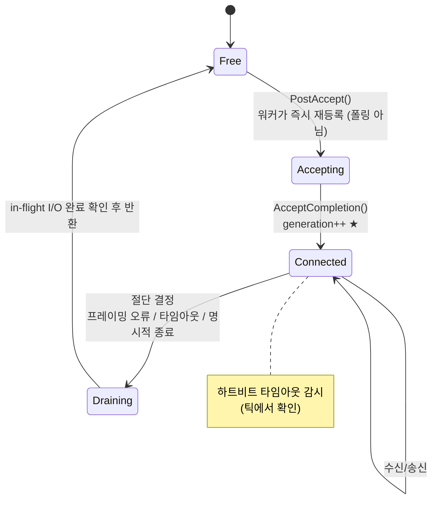
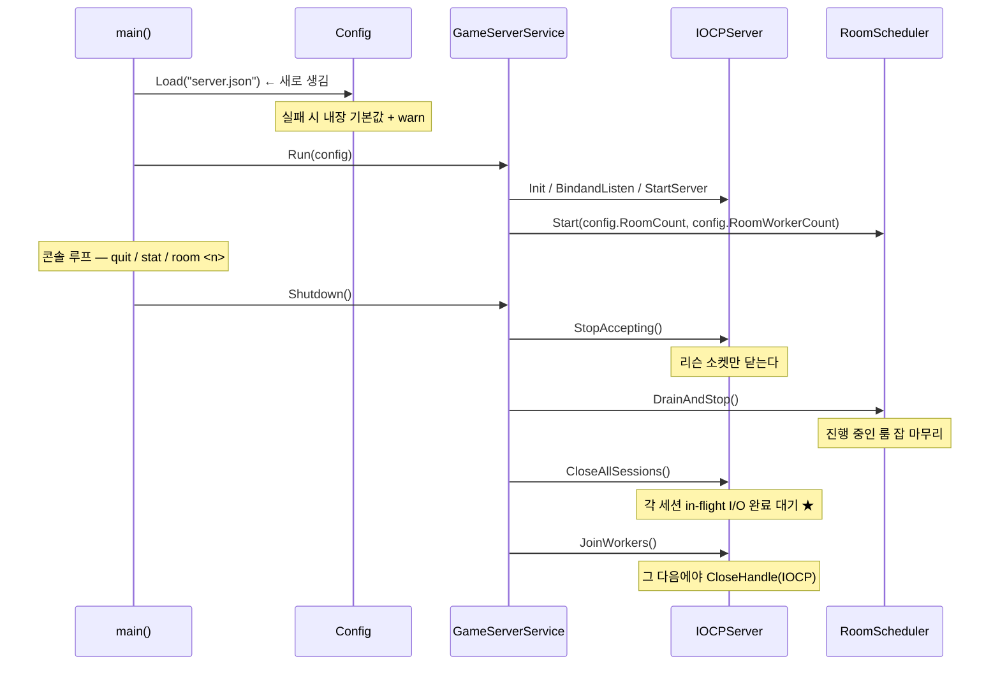
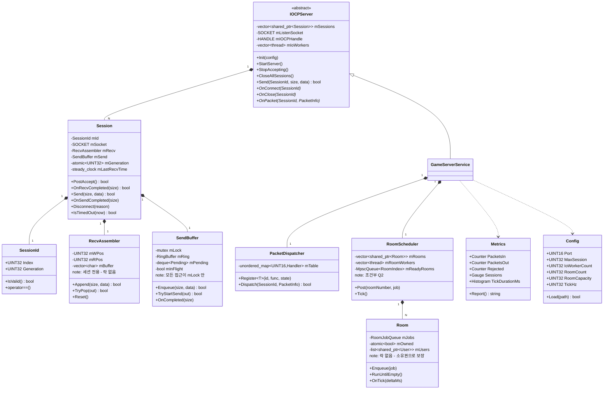
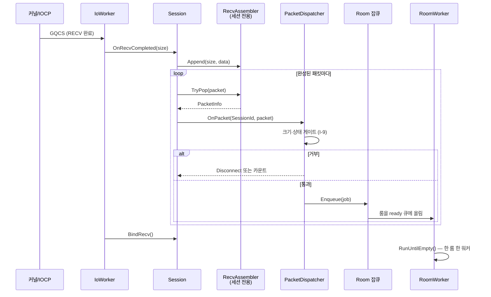
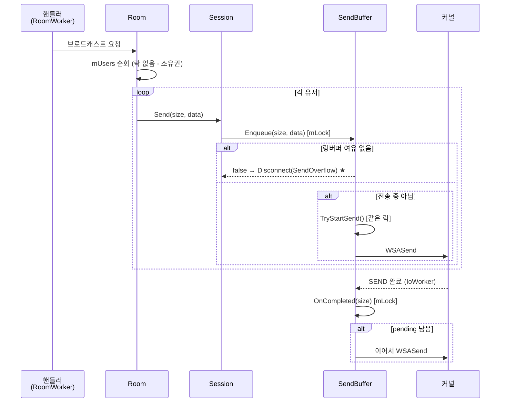
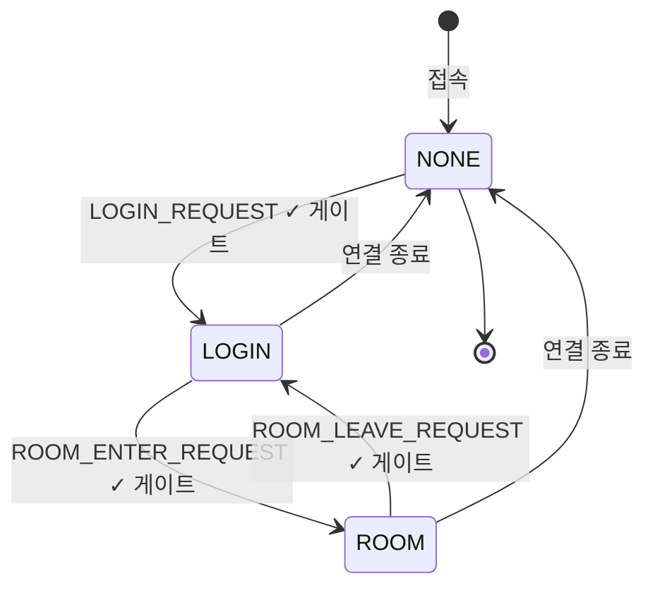

# 목표 구성도

[structure.md](structure.md)가 **지금**을 그린다면, 이 문서는 **Phase 6까지 끝난 뒤**를 그린다.
절 번호를 structure.md와 일부러 맞췄다. 같은 번호끼리 나란히 놓고 보라는 뜻이다.

> **이건 청사진이지 사양서가 아니다.** 아직 답이 안 나온 질문에 달린 부분이 있고,
> 그런 곳은 「조건부」로 표시했다. 조건부 항목을 확정된 것처럼 구현하지 마라.
>
> **충족 조건은 [target-spec.md](target-spec.md)에 요구사항 ID로 규정되어 있다.**
> 이 문서가 "어떻게 생겼는가"라면 사양서는 "무엇을 만족해야 하는가"다.

---

## 0. 확정도 표기

이 문서의 모든 항목에는 다음 중 하나가 붙는다.

| 표기 | 뜻 |
|---|---|
| **확정** | 결함 해소를 위해 반드시 필요하고 방향이 정해졌다. review-log 항목이 근거 |
| **조건부** | 답변 대기 중인 질문에 따라 달라진다. 무엇에 달렸는지 함께 적었다 |
| **검토중** | 필요한지 자체가 아직 판단되지 않았다. 넣지 않고 끝날 수도 있다 |

### 목표를 좌우하는 미결 질문

| # | 질문 | 이게 바꾸는 것 |
|---|---|---|
| Q1 | `SendThread`를 왜 껐나? (D-004) | §2 스레드 구성, §10.2 송신 흐름 |
| Q2 | 어떤 게임인가? 전투·아이템이 있나? | §2 룸 워커 필요성, §11 서버 권위, §6 클래스 |
| Q3 | 룸 10 / 정원 4는 확정값인가? | §7 객체 수, §9 메모리, §3 설정 |
| Q4 | 목표 동시 접속은? (`MAX_CLIENT` 100이 임시값인가) | §1, §7, §9 전부 |
| Q5 | Redis/DB를 넣나? (D-008) | §1 토폴로지, §4 폴더, §6 클래스 |

**Q1·Q2가 가장 크다.** 나머지는 숫자만 바뀐다.

---

## 1. 목표 네트워크 계층

### 1.1 배포 토폴로지 — **확정**

**바뀌지 않는다.** 단일 서버 데모라는 목표(D-009 맥락)에서 분산은 범위 밖이다.

```
┌─────────────────────── 단일 호스트 (Windows x64) ──────────────────────┐
│                                                                        │
│   fl-client ×N            DummyClient ×N (부하 도구)                    │
│        └────────────┬──────────────┘                                   │
│                     │  TCP / IPv4 / :9000                              │
│              ┌──────▼──────────┐                                        │
│              │ GameServer.exe  │                                        │
│              │  + 메트릭 (콘솔) │  ← 새로 생김                            │
│              └──────┬──────────┘                                        │
│                     │                                                   │
│              ┌──────▼──────────┐                                        │
│              │  Redis / DB     │  ← 【조건부 Q5】 안 넣으면 통째로 없음    │
│              └─────────────────┘                                        │
└────────────────────────────────────────────────────────────────────────┘
```

**끝까지 안 들어오는 것:** 로드밸런서, 계정 서버 분리, 샤딩, 다중 프로세스.
이유는 [limits.md](limits.md) 「의도적으로 범위 밖」에 있다.

### 1.2 소켓 구성 — **확정**

| 소켓 | 개수 | 지금과 다른 점 |
|---|---|---|
| 리슨 소켓 | 1 | `backlog`를 5 → `SOMAXCONN`으로 |
| 접속 소켓 | `MAX_SESSION` | `SetSocketOption()`을 **실제로 호출한다** (지금은 죽은 코드) |

`TCP_NODELAY`를 켠다. 캐릭터 동기화가 20~30Hz 소량 패킷이라 Nagle 지연이 그대로 체감된다.
`SO_RCVBUF = 0`은 **켜지 않는다** — 제로 카피 수신은 이 규모에서 이득보다 위험이 크다.

### 1.3 프로토콜 스택 — **확정 + 조건부**

```
┌──────────────────────────────────────────────────────┐
│ 애플리케이션                                          │
│   PACKET_HEADER(6B) + pack(1) 바디                    │  확정: 그대로
│   static_assert로 크기 고정                            │  확정 (R-012)
│   프레이밍 하한/상한 양방향 검증                        │  확정 (R-017)
│   버전 협상 (핸드셰이크 2바이트)                        │  검토중
├──────────────────────────────────────────────────────┤
│ 전송  TCP                                             │
└──────────────────────────────────────────────────────┘
```

**와이어 포맷은 바꾸지 않는다.** fl-client 동시 수정이 필요한 변경은 이득이 명확할 때만 한다.

**버전 협상 — 검토중.** `SYS_CONNECT_RESPONSE_PACKET`의 미사용 `Type`/`Reserved` 자리나
로그인 요청에 빌드 번호 2바이트를 넣으면, 클라/서버 빌드 불일치가 "조용히 깨짐"에서
"명확한 거부"로 바뀐다. 자체 엔진 클라이언트를 같은 사람이 개발하므로 실제로 자주 겪을
문제다. 다만 와이어를 건드리므로 **fl-client 작업과 묶어서 판단한다.**

### 1.4 연결 수명 — **확정**



지금과 달라지는 것:

| 항목 | 지금 | 목표 | 근거 |
|---|---|---|---|
| 세션 식별 | 인덱스만 | **`{index, generation}`** | R-010 |
| 재사용 대기 | 3초 고정 (`RE_USE_SESSION_WAIT_TIMESEC`) | **불필요 — 제거** | generation이 대신한다 |
| Accept 재등록 | AccepterThread가 32ms 폴링 | 세션 반환 시점에 **즉시** | 폴링 제거 |
| 절단 사유 | 소켓 오류뿐 | 프로토콜 위반 / 타임아웃 추가 | R-017, R-005 |
| 유휴 타임아웃 | 없음 | 있음 (틱에서 감시) | 좀비 연결 방지 |

**`RE_USE_SESSION_WAIT_TIMESEC`이 사라지는 게 핵심이다.** 3초 지연은 세대값이 없어서
쓰던 땜빵이었다. 세대값이 들어오면 슬롯을 즉시 재사용해도 안전하다.

---

## 2. 목표 프로세스 / 스레드 계층

### 2.1 스레드 구성 — **조건부 Q2**

두 가지 안이 있고, **답은 게임의 종류에 달렸다.**

#### 안 A — 룸 액터 (권장, Q2에서 전투·AI가 있으면 확정)

```
GameServer.exe
│
├─ MainThread ×1 ─────────── 콘솔 명령 (quit, stat, room <n>)
│
├─ IoWorker ×4 ───────────── GetQueuedCompletionStatus
│                            ACCEPT / RECV / SEND 완료만
│                            게임 상태를 절대 만지지 않음 ★ I-2
│                            수신 조립 → 완성된 패킷을 룸 큐로
│
├─ RoomWorker ×2 ─────────── 처리할 룸을 하나 집어 큐를 비움
│   (조건부 Q3/Q4)           한 룸은 동시에 한 워커만 ★ 소유권
│                            30Hz 고정 틱
│
└─ (AccepterThread 없음) ─── Accept 재등록이 워커에서 즉시 일어남
```

**핵심은 처리량이 아니라 불변식이다.** 룸당 4명 × 10룸이면 단일 스레드로 차고 넘친다.
액터 모델의 이득은 **"룸 내부는 단일 스레드"가 락이 아니라 소유권으로 보장**되어,
이후 어떤 게임 로직을 넣어도 동시성을 고민할 필요가 없다는 것이다.

#### 안 B — 단일 로직 스레드 유지 (Q2에서 로직이 가벼우면)

```
├─ IoWorker ×4
└─ LogicThread ×1 ────────── 모든 룸 + 30Hz 틱
```

`Room::m_RoomLock`은 **어느 쪽이든 사라진다** (R-013). A에서는 소유권이,
B에서는 단일 스레드가 대신한다.

| | 안 A (룸 액터) | 안 B (단일 로직 스레드) |
|---|---|---|
| 코드 증가 | +100~150줄 (잡큐 + 디스패치) | +30줄 (틱 루프) |
| 불변식 강제 | 소유권으로 **구조적 보장** | 관례 (지금과 같음) |
| 한 룸이 느려지면 | 그 룸만 느려짐 | 전 서버가 멈춤 |
| 포트폴리오 설명거리 | 있음 | 없음 |
| 이 규모에서 필요? | 아니오 | — |

### 2.2 `SendThread` 결론 — **조건부 Q1**

| Q1의 답 | 목표 구조 |
|---|---|
| "폴링 비용 때문에 껐다" | 되살리지 않는다. **삭제.** 링버퍼 + pending 큐로 해결 (§10.2) |
| "지연이 늘어서 껐다" | 삭제. 즉시 송신 유지 |
| "그냥 디버깅 중 임시로 껐다" | **틱 기반 배칭으로 되살릴 후보.** 룸 워커의 틱에서 룸 단위로 모아 보내면 `CHARACTER_SYNC` 송신 횟수가 크게 준다 |

**셋 중 어느 쪽이든 "구현은 있는데 꺼져 있음" 상태는 끝난다.** 죽은 코드는 남기지 않는다.

### 2.3 기동 / 종료 — **확정**



**종료 순서가 지금과 다르다.** 현재 `DestroyThread()`는 워커가 도는 중에
`CloseHandle(mIOCPHandle)`을 호출한다. 목표는 **수용 중단 → 로직 배수 → 세션 정리 →
워커 조인 → 핸들 해제** 순서다.

---

## 3. 목표 빌드 / 프로그램 계층

### 3.1 프로그램 목록 — **확정**

| 프로그램 | 종류 | 지금 대비 |
|---|---|---|
| `GameServer.exe` | Application | 그대로 |
| `DummyClient.exe` | Application | **빈 껍데기 → 실제 도구** (Task 1.3) + 다중 접속 부하 모드 |
| `ServerCore.lib` | StaticLibrary | 그대로 |
| `Tests.exe` | Application | **신규** (Task 0.2) |

### 3.2 빌드 설정 — **확정**

| 항목 | 지금 | 목표 |
|---|---|---|
| 툴셋 / 표준 | v143 / stdcpp20 | 그대로 |
| 경고 수준 | 기본 | `/W4` (검토중: `/WX`는 과할 수 있음) |
| 의존성 선언 | vcpkg 통합 + 헤더 주석 | **`vcpkg.json` 매니페스트** |
| 링크 방식 | `#pragma comment(lib, "Debug\\...")` | **프로젝트 참조** (R-019 인접) |
| 정적 분석 | 없음 | 검토중 |

**`vcpkg.json`이 필요한 이유:** 지금은 `CorePch.h` 주석에 `vcpkg install spdlog` 라고
적혀 있는 게 유일한 의존성 기록이다. 매니페스트가 있으면 새 환경에서 `vcpkg install`
한 번으로 끝나고, CI를 붙일 때 전제조건이 된다.

```json
{
  "name": "fl-server",
  "version-string": "0.1.0",
  "dependencies": [ "spdlog", "catch2" ]
}
```

### 3.3 CI — **검토중**

GitHub Actions에서 x64 Debug/Release 빌드 + `Tests.exe` 실행.
`.github/`가 이미 있으므로 워크플로 파일 하나면 된다.

**지금 안 하는 이유:** 테스트가 없으면 CI가 빌드만 확인한다. 그건 로컬 빌드로 충분하다.
Phase 0에서 테스트가 생긴 뒤에 붙이는 게 순서다.

---

## 4. 목표 폴더 구조

```
fl-server/
│
├── fl-server.sln
├── vcpkg.json ............................ ★ 신규 — 의존성 매니페스트
├── server.json ........................... ★ 신규 — 런타임 설정 (R-015)
│
├── AGENTS.md / CLAUDE.md / .github/ ...... 그대로
├── .gitignore ............................ ★ 정리 (R-019)
│
├── ServerCore/ ........................... [정적 lib] 소켓 I/O 전용
│   │
│   ├── (기존 유지)
│   │   pch.h  CorePch.h  Define.h  Enums.h  Enum_*.h
│   │   OverlappedEx.h  PacketHeader.h  PacketInfo.h
│   │   IOCPServer.h/.cpp
│   │
│   ├── Session.h/.cpp .................... ★ stClientInfo 개명 + 재구성
│   │                                        연결 1개의 전부를 소유
│   ├── SessionId.h ....................... ★ {index, generation} (R-010)
│   ├── SendBuffer.h/.cpp ................. ★ 링버퍼 + pending 큐 (R-001/R-002)
│   ├── RecvAssembler.h/.cpp .............. ★ PacketBuffer 개명 + 세션 전용화 (R-016)
│   │
│   ├── Server_Function.h ................. SendPacketTo<T> 추가 (R-004/R-018)
│   │
│   └── ✂ 삭제
│       Packet.h/.cpp ..................... PacketData 미사용
│       Types.h ........................... 별칭 미사용
│       Server_Defines.h .................. 한 줄짜리 경유 헤더
│
├── GameServer/ ........................... [exe] 게임 로직
│   │
│   ├── GameServer.cpp .................... main + 콘솔 명령
│   ├── GameServerService.h/.cpp .......... 어댑터 (그대로)
│   │
│   ├── PacketDispatchRule.h .............. ★ 판정 규칙 (Task 2.1, 이미 계획됨)
│   ├── PacketDispatcher.h/.cpp ........... ★ PacketManager에서 디스패치만 분리
│   ├── Handlers_Login.cpp ................ ★ 【검토중】 §5.3 참조
│   ├── Handlers_Room.cpp ................. ★ 【검토중】
│   ├── Handlers_Sync.cpp ................. ★ 【검토중】
│   │
│   ├── UserManager.h/.cpp  User.h/.cpp ... 그대로 (시그니처만 수정)
│   ├── RoomManager.h/.cpp  Room.h/.cpp ... 그대로
│   ├── RoomJobQueue.h/.cpp ............... ★ 【조건부 Q2 — 안 A일 때만】
│   ├── RoomScheduler.h/.cpp .............. ★ 【조건부 Q2 — 안 A일 때만】
│   │
│   ├── Config.h/.cpp ..................... ★ server.json 로딩 (R-015)
│   ├── Metrics.h/.cpp .................... ★ 카운터 + stat 출력
│   │
│   └── Packet_*.h ........................ 그대로 + static_assert
│
├── DummyClient/ .......................... [exe] 검증·부하 도구
│   ├── DummyClient.cpp ................... ★ REPL (Task 1.3)
│   ├── LoadMode.cpp ...................... ★ N개 동시 접속 + 20Hz 동기화
│   └── README.md ......................... ★ 명령어 문서
│
├── Tests/ ................................ ★ 신규 [exe]
│   ├── pch.h/.cpp
│   ├── Test_RecvAssembler.cpp ............ 프레이밍 (Task 0.3/0.4/0.5)
│   ├── Test_SendBuffer.cpp ............... ★ 링버퍼 경계·overflow
│   ├── Test_PacketDispatch.cpp ........... 판정 규칙 (Task 2.1)
│   └── Test_SessionId.cpp ................ ★ 세대값 판정
│
├── docs/ ................................. 그대로 (+ 이 문서)
│
├── Libraries/  Binary/ ................... 빌드 산출물
└── ✂ backup/ ............................. 삭제 (git에 없는 로컬 잔재)
```

### 4.1 삭제 목록 — **확정**

| 대상 | 이유 |
|---|---|
| `ServerCore/Packet.h/.cpp` | `PacketData`를 아무도 안 쓴다 |
| `ServerCore/Types.h` | `int32` 별칭을 아무도 안 쓴다 |
| `ServerCore/Server_Defines.h` | `Server_Function.h` 하나만 포함하는 경유 헤더 |
| `IOCPServer::SendThread` / `CreateSendThread` | Q1 답변에 따라 되살리거나 삭제 |
| `backup/` | 리팩터링 이전 구조. git에 없다 |
| `UserManager::IncreaseUserCnt` / `DecreaseUserCnt` | 호출되지 않는다 (R-008) |
| `RE_USE_SESSION_WAIT_TIMESEC` | 세대값이 대체 |

**삭제가 추가만큼 중요하다.** 목표 구조는 지금보다 파일이 몇 개 더 늘지만,
죽은 코드는 전부 없어진다.

---

## 5. 목표 파일 계층

### 5.1 새로 생기는 파일과 그 책임

| 파일 | 책임 | 왜 별도 파일인가 | 근거 |
|---|---|---|---|
| `SessionId.h` | `{index, generation}` 값 타입 + 비교 | 값 타입 하나, 헤더 전용, 테스트 대상 | R-010 |
| `SendBuffer.h/.cpp` | 링버퍼 + pending 큐 + 락 도메인 | 송신 상태를 한 곳에 모아야 R-002가 재발 불가 | R-001 R-002 |
| `RecvAssembler.h/.cpp` | 스트림 → 패킷 경계 | 세션 전용이 되면 락이 필요 없어짐 | R-016 |
| `PacketDispatcher.h/.cpp` | ID → 핸들러 + 크기·상태 게이트 | 디스패치와 핸들러 구현은 수명주기가 다름 | R-005 R-009 |
| `Config.h/.cpp` | `server.json` 로딩, 기본값 폴백 | 상수가 코드에서 빠짐 | R-015 |
| `Metrics.h/.cpp` | 카운터 수집 + `stat` 출력 | 로그와 메트릭은 다른 것 | R-011 |
| `RoomJobQueue.h/.cpp` | 룸 하나의 입력 큐 | 【조건부 Q2】 | R-013 |
| `RoomScheduler.h/.cpp` | 워커가 룸을 집는 규칙 | 【조건부 Q2】 | R-013 |

### 5.2 개명

| 지금 | 목표 | 이유 |
|---|---|---|
| `stClientInfo` | `Session` | "Info"는 데이터 묶음처럼 들리는데 실제로는 I/O 상태 기계다 |
| `PacketBuffer` | `RecvAssembler` | 하는 일이 "버퍼"가 아니라 "경계 복원"이다. `SendBuffer`와 헷갈리지 않게 |
| `PacketManager` | `PacketDispatcher` (+ 핸들러 분리) | 매니저가 아니라 디스패처다 |

> **개명은 단독 커밋으로 하지 않는다.** 순수 이름 변경은 diff만 키우고 검토를 방해한다.
> 해당 파일을 어차피 재작성하는 Phase에서 함께 한다.

### 5.3 `PacketManager` 분할 — **검토중**

지금 336줄이고 이 저장소에서 가장 크다. 목표에서는 디스패처가 분리되므로
핸들러 본문만 남아 더 짧아진다.

**분할 판단은 Phase 2 이후로 미룬다.** 그때 실측한 줄 수를 보고 정한다.

| 조건 | 판단 |
|---|---|
| 핸들러 합계 300줄 미만 | 한 파일 유지 |
| 300~500줄 | 도메인별 분할 검토 (`Handlers_Login` / `Handlers_Room` / `Handlers_Sync`) |
| 500줄 초과 | 분할 |

**지금 미리 쪼개지 않는 이유:** 파일이 3개로 늘면 `PacketDispatcher`와의 배선이
늘어난다. 필요해지기 전에 치르는 비용이다.

---

## 6. 목표 클래스 구성



### 6.1 지금과의 클래스 대응

| 지금 | 목표 | 변화의 성격 |
|---|---|---|
| `stClientInfo` | `Session` | 개명 + `RecvAssembler`/`SendBuffer`를 소유하도록 재구성 |
| `PacketBuffer` (User 소유) | `RecvAssembler` (**Session** 소유) | **소유자가 바뀐다** ★ 이게 R-016의 해법 |
| `mSendBuf`/`mSendingBuf` 배열 | `SendBuffer` 클래스 | 상태를 한 클래스로 모아 R-002가 재발 불가 |
| `PacketManager` | `PacketDispatcher` + 핸들러 | 책임 분리 |
| `RoomManager` | `RoomScheduler` | 조회 + **실행 스케줄링** 【조건부 Q2】 |
| `User`, `Room`, `UserManager` | 그대로 | 이름·책임 유지 |
| — | `SessionId`, `Config`, `Metrics` | 신규 |

### 6.2 계층 경계 — **확정**

```
        ┌──────────── GameServer (게임을 안다) ───────────┐
        │ GameServerService  PacketDispatcher            │
        │ RoomScheduler  Room  User  *Manager            │
        │ Config  Metrics                                │
        └──────┬──────────────────────────▲──────────────┘
               │ OnConnect(SessionId)      │ Send(SessionId, ...)
               │ OnPacket(SessionId, pkt)  │
               │ OnClose(SessionId)        │
        ┌──────▼──────────────────────────┴──────────────┐
        │ IOCPServer  Session  RecvAssembler  SendBuffer │
        └──────────── ServerCore (게임을 모른다) ─────────┘
```

경계는 여전히 **4개**다. 다만 두 가지가 바뀐다.

1. `OnReceive(clientIndex, size, rawBuffer)` → **`OnPacket(SessionId, PacketInfo)`**
   — 조립이 ServerCore 안에서 끝나므로 게임 계층은 **완성된 패킷만** 받는다.
2. `UINT32 clientIndex` → **`SessionId`** — 세대값이 경계를 넘는다.

**이 두 변경이 R-016과 R-010을 동시에 구조적으로 해소한다.**

### 6.3 콜백 배선 — **확정**

`std::function` 세 번 복사가 사라진다 (R-018 해소).

```
지금                                    목표
GameServerService의 람다                GameServerService가 IOCPServer를 상속하므로
  ├─→ PacketManager::SendPacketFunc      Send()를 직접 호출한다.
  ├─→ RoomManager::SendPacketFunc  ⚠     Room은 Send를 호출하는 인터페이스 포인터
  └─→ Room::SendPacketFunc               하나만 들고 있으면 된다.
     (UINT16/UINT32 불일치)
```

`Room`에 `ISendChannel*` 같은 얇은 인터페이스 하나를 주거나, 브로드캐스트를
`RoomScheduler`가 대신 수행한다. **어느 쪽이든 시그니처가 한 곳에서만 정의된다.**

---

## 7. 목표 객체 인스턴스 맵

**【조건부 Q3/Q4】** 아래 숫자는 현재 값 기준이다. 목표 동시 접속이 정해지면 바뀐다.

```
GameServer.exe
│
├── Config ×1                          ← server.json에서 로드
├── Metrics ×1
│
├── GameServerService ×1
│   ├── [IOCPServer 부분]
│   │   ├── mSessions ──────────────── Session ×MaxSession (100)
│   │   │                                ├── RecvAssembler ×100  (8 KB 버퍼)
│   │   │                                ├── SendBuffer ×100     (16 KB 링)
│   │   │                                ├── SessionId ×100
│   │   │                                └── stOverlappedEx ×300
│   │   └── mIoWorkers ×4
│   │
│   ├── PacketDispatcher ×1
│   │   └── mTable  항목 9개 (크기+상태 규칙 포함)
│   │
│   ├── UserManager ×1
│   │   └── User ×100                    ← PacketBuffer가 **빠진다**
│   │
│   └── RoomScheduler ×1                 【조건부 Q2】
│       ├── Room ×RoomCount (10)
│       │     └── RoomJobQueue ×10
│       └── mRoomWorkers ×2
│
└── 총 상주 객체: ≈ 225 + 스레드 7
```

**가장 큰 변화:** `User`가 `PacketBuffer`를 더 이상 소유하지 않는다.
조립은 세션의 일이고, 유저는 게임 상태만 갖는다. 책임이 제자리를 찾는다.

---

## 8. 목표 스레드 소유권 맵

**이 표가 목표 설계의 핵심이다.** structure.md §8과 나란히 놓고 보라.
⚠ 표시가 하나도 없는 것이 목표다.

| 객체 / 필드 | Main | IoWorker ×4 | RoomWorker ×2 | 보호 수단 |
|---|:---:|:---:|:---:|---|
| `mListenSocket` | 생성/종료 | 읽기 | — | 읽기 전용 |
| `mSessions[]` (컨테이너) | 생성 | 읽기 | 읽기 | 크기 불변 |
| `Session::mGeneration` | — | 쓰기(accept) | 읽기 | `atomic` |
| `Session::mSocket` | — | 읽기/쓰기 | — | **세션당 1워커** |
| `Session::mRecv` (RecvAssembler) | — | **전용** | — | **소유권** ★ |
| `Session::mSend` (SendBuffer) | — | 읽기/쓰기 | 쓰기 | `SendBuffer::mLock` ★ |
| `PacketDispatcher::mTable` | 생성 | — | 읽기 | 기동 후 불변 |
| `Room::mUsers` | — | — | **전용** | **소유권** ★ |
| `Room::mJobs` | — | 쓰기(post) | 읽기 | MPSC 큐 |
| `RoomScheduler::mReadyRooms` | — | 쓰기 | 읽기/쓰기 | MPSC 큐 |
| `UserManager::mUserIDDictionary` | — | — | 읽기/쓰기 | 【조건부 Q2】 §8.2 |
| `Metrics` 카운터 | 읽기(stat) | 쓰기 | 쓰기 | `atomic` |
| `Config` | 생성 | 읽기 | 읽기 | 기동 후 불변 |

### 8.1 규칙이 코드로 강제되는 방식

| 불변식 | 지금 | 목표의 강제 수단 |
|---|---|---|
| I-1 게임 로직은 지정된 스레드에서만 | 관례 | `assert(mOwnerThreadId == GetCurrentThreadId())` |
| I-2 I/O 스레드는 게임 상태를 안 만진다 | **위반 중** | **타입으로 강제** — `OnPacket`이 `PacketInfo`만 넘긴다 |
| I-3 인덱스 = 세션 ID | 없음 | `SessionId` 값 타입 (raw index를 못 넘김) |
| I-4 객체는 해제되지 않는다 | 없음 | 그대로 (문서로만) |
| I-6/I-7 와이어 크기 | 없음 | `static_assert` |
| I-9 핸들러 실행 조건 | 없음 | `IsAcceptablePacket` 게이트 |
| **I-10 (신규)** 한 룸은 한 워커만 | — | `Room::mOwned` CAS + `assert` |

**"문서에 적힌 불변식은 코드로 옮겨지기 전까지의 임시 거처"** — 목표는 이 표의
「강제 수단」 칸을 전부 채우는 것이다.

### 8.2 미해결 — `UserManager`의 스레드 소속 【조건부 Q2】

안 A(룸 액터)를 택하면 **답이 필요한 지점이 하나 생긴다.**

`UserManager::mUserIDDictionary`는 로그인/로그아웃에서 쓰이는데, 로그인은 룸에
들어가기 **전** 상태다. 즉 어느 룸에도 속하지 않는다.

| 안 | 방법 | 평가 |
|---|---|---|
| A-1 | "로비"를 룸 0번처럼 취급, 로그인 잡을 로비 액터가 처리 | 일관적. 특수 케이스가 안 생김 |
| A-2 | `UserManager`에만 mutex | 간단하지만 "락 없는 설계"에 예외가 생김 |
| A-3 | 로그인 전용 스레드 1개 | 스레드가 늘어남. 과함 |

**A-1을 권한다.** 룸 액터 모델을 택하는 이유가 "특수 케이스를 없애는 것"인데
A-2는 그 자리에 예외를 만든다. 다만 **안 B를 택하면 이 질문 자체가 사라진다.**

---

## 9. 목표 메모리 레이아웃

### 9.1 세션 하나

```
Session  ≈ 17 KB   (지금 8.5 KB + 조립 버퍼가 여기로 이사)
┌────────────────────────────────────────────────┐
│ SessionId {Index, Generation}           8 B    │
│ mSocket, mIOCPHandle                   16 B    │
│ mLastRecvTime  steady_clock             8 B    │  ← 타임아웃 감시용
├────────────────────────────────────────────────┤
│ stOverlappedEx ×3                     168 B    │
│ mAcceptBuf[64]                         64 B    │
│ mRecvBuf                    [힙] 1,024 B       │  ← 256 → 1 KB
├────────────────────────────────────────────────┤
│ RecvAssembler                                  │
│   └ 버퍼                    [힙] 8,192 B       │  ← 64 KB → 8 KB ★
├────────────────────────────────────────────────┤
│ SendBuffer                                     │
│   ├ mLock  mutex                       80 B    │
│   ├ 링버퍼                  [힙] 16,384 B      │  ← 4+4 KB → 16 KB ★
│   └ mPending  deque                   (가변)   │
└────────────────────────────────────────────────┘
```

### 9.2 버퍼 크기 재산정 근거

| 버퍼 | 지금 | 목표 | 근거 |
|---|---:|---:|---|
| 수신 소켓 버퍼 (`MAX_SOCKBUF`) | 256 B | **1 KB** | 최대 패킷 296 B. 1 KB면 대부분 1회 수신으로 끝나 조립 횟수가 준다 |
| 조립 버퍼 (`PACKET_DATA_BUFFER_SIZE`) | 64 KB | **8 KB** | 최대 패킷 296 B. 8 KB면 미완성 패킷 + 여유가 충분. **버림 88 % → 큰 절감** |
| 송신 버퍼 (`MAX_SOCK_SENDBUF`) | 4 KB ×2 | **16 KB 링** | 4인 룸 브로드캐스트 × 30Hz 버스트를 견뎌야 함. 이중 버퍼 대신 링 하나 |

**핵심 교체:** 조립 버퍼를 64 KB → 8 KB로 줄이고, 그 절감분으로 송신을 4 KB → 16 KB로 늘린다.
[limits.md](limits.md) 「자원 배분의 불균형」에서 지적한 "큰 쪽이 필요 없고 작은 쪽이 모자란다"의 해소다.

### 9.3 총 상주 메모리 (100세션 기준)

| 항목 | 지금 | 목표 | 차이 |
|---|---:|---:|---:|
| 조립 버퍼 | 6,400 KB | 800 KB | **−5,600 KB** |
| 송신 버퍼 | 800 KB | 1,600 KB | +800 KB |
| 수신 소켓 버퍼 | 25 KB | 100 KB | +75 KB |
| 세션 본체 | 50 KB | 30 KB | −20 KB |
| `User` (버퍼 제외) | 12 KB | 12 KB | — |
| `Room` + 잡큐 | 2 KB | 10 KB | +8 KB |
| **합계** | **≈ 7.3 MB** | **≈ 2.5 MB** | **−66 %** |

**메모리를 3분의 1로 줄이면서 송신 용량은 4배로 늘린다.**
지금 배분이 얼마나 어긋나 있었는지를 보여주는 숫자다.

> 이 숫자들은 **목표치이지 측정값이 아니다.** Phase 6의 부하 테스트에서
> 실제 큐 길이와 버퍼 사용률을 재고 나서 확정한다.

---

## 10. 목표 데이터 흐름

### 10.1 수신 — **확정**



**지금과의 결정적 차이:** 조립이 `IoWorker` 안에서 **세션 전용 버퍼로** 끝난다.
게임 계층은 완성된 패킷만 받으므로 `User::PacketBuffer`가 존재하지 않고,
따라서 **R-016이 재발할 자리가 없다.**

### 10.2 송신 — **확정 (배칭은 조건부 Q1)**



**세 가지가 구조적으로 바뀐다.**

| 지금 | 목표 |
|---|---|
| 버퍼가 차면 `mSendPos = 0` — **조용히 덮어씀** | `Enqueue`가 `false` — **명시적 절단** (R-001) |
| `mIsSending`을 락 밖에서 씀 | **모든 접근이 `SendBuffer::mLock` 안** (R-002) |
| 완료 후 아무것도 안 함 | 완료 시 pending을 이어서 전송 |

> **조용한 데이터 손상보다 명시적 절단이 낫다.** 이건 설계 원칙이지 타협이 아니다.

**틱 배칭 【조건부 Q1】** — Q1이 "임시로 껐다"면, 룸 틱에서 `CHARACTER_SYNC`를 모아
한 번에 보내는 것이 후보다. 4인 룸 30Hz에서 개별 전송 대비 송신 호출이 크게 준다.

### 10.3 틱 — **조건부 Q2 (하지만 어느 안이든 틱은 생긴다)**

```
매 틱 (30Hz = 33.3ms):
  1. 잡큐 배수 — 쌓인 패킷 처리
  2. 타임아웃 검사 — 유휴 세션 절단
  3. 상태 브로드캐스트 — 【조건부】 모아 보내기
  4. 메트릭 기록 — 틱 소요 시간 히스토그램
```

**틱 자체는 확정이다.** 지금은 `sleep(1ms)` 폴링이라 주기적 작업을 걸 자리가 없다.
안 A든 B든 고정 틱이 들어온다.

---

## 11. 목표 상태 기계

### 11.1 유저 도메인 상태 — **확정**



**전이는 그대로다.** 달라지는 것은 **전이 조건이 코드로 강제**된다는 것 (I-9).
지금은 상태를 아무도 검사하지 않는다 (R-009).

【조건부 Q5】 Redis/DB를 넣으면 `NONE → AUTHENTICATING → LOGIN`으로 중간 상태가 하나 는다.
비동기 DB 응답을 기다리는 동안의 상태다.

### 11.2 절단 사유 — **확정 (신규)**

지금은 소켓 오류로만 끊긴다. 목표는 사유를 분류한다.

| 사유 | 트리거 | 로그 레벨 |
|---|---|---|
| `PeerClosed` | 수신 0바이트 | debug |
| `SocketError` | I/O 오류 | info |
| `ProtocolViolation` | 프레이밍 깨짐 (R-017) | warn |
| `RejectThreshold` | 거부 누적 초과 (R-005/R-009) | warn |
| `SendOverflow` | 송신 링버퍼 초과 (R-001) | **error** ← 서버 문제일 수 있음 |
| `IdleTimeout` | 하트비트 없음 | info |
| `ServerShutdown` | 정상 종료 | debug |

**`SendOverflow`만 `error`인 이유:** 다른 것은 클라이언트 사정이지만, 이건
서버가 보낼 것을 다 못 보내고 있다는 신호다. 버퍼 크기 재산정의 근거가 된다.

### 11.3 서버 권위 — **조건부 Q2**

| Q2의 답 | 목표 |
|---|---|
| 채팅·아바타 중심 (전투 없음) | **현행 유지** — 클라이언트 신뢰. `ClientIndex` 위조만 차단 |
| 전투·아이템 있음 | 위치 검증(속도 상한), 서버 권위 상태, 클라 예측 + 서버 보정 |

**어느 쪽이든 최소한 하나는 확정이다** — `CHARACTER_SYNC`의 `ClientIndex`가
실제 송신자인지 서버가 확인한다. 지금은 남의 캐릭터를 조종할 수 있다.

---

## 12. 목표 프로토콜

**와이어 포맷은 바꾸지 않는다.** 패킷 목록도 그대로다. 달라지는 것은 취급이다.

| 항목 | 지금 | 목표 | 근거 |
|---|---|---|---|
| 크기 검증 | `ProcessLogin`만 | **전 패킷, 디스패처 한 곳** | R-005 |
| 상태 검증 | 없음 | **전 패킷, 등록 시 함께 선언** | R-009 |
| 프레이밍 하한 | 없음 | `PacketLength >= 6` | R-017 |
| 프레이밍 상한 | 잔여 바이트만 | `PacketLength <= 조립버퍼` | 신규 |
| 크기 상수 | 계산에 의존 | `static_assert` | R-012 |
| 응답 대역 수신 | `LOGIN_RESPONSE` 등록됨 | 등록 자체를 안 함 | R-006 |
| 송신자 검증 | 없음 | `ClientIndex == SessionId.Index` | §11.3 |
| 버전 협상 | 없음 | 【검토중】 | §1.3 |

### 12.1 패킷 추가 절차 — **확정**

```
1. Enum_PacketId.h 에 ID 추가          (기존 값 재사용 금지)
2. Packet_*.h 에 pack(1) 구조체 + static_assert
3. PacketDispatcher::Register<T>(id, handler, requiredState)
      ↑ 크기는 sizeof(T)로 자동, 상태는 명시 필수
4. protocol.md 표 갱신
5. fl-client 헤더 동기화
```

**3번이 핵심이다.** 지금은 핸들러만 등록하면 되지만, 목표에서는 **요구 상태를 적지 않으면
컴파일이 안 된다.** 검증을 잊는 것이 불가능해진다.

---

## 13. 현재 → 목표 마이그레이션 맵

| Phase | 무엇을 | 해소 | 이 문서의 절 | 시작 조건 |
|---|---|---|---|---|
| **0** | 테스트 안전망, 프레이밍 하한, `static_assert` | R-017 R-012 | §3.1 §12 | 없음 — **지금 시작 가능** |
| **1** | 확정적 버그, DummyClient 구현 | R-003 R-004 R-006 R-007 R-008 R-011 R-014 | §3.1 §5 | Phase 0 |
| **2** | 디스패처 게이트 | R-005 R-009 | §6 §12 | Phase 1 |
| **3** | `SendBuffer` 도입, `SendPacketTo<T>` | R-001 R-002 R-018 | §5.1 §9.2 §10.2 | **Q1 답변** |
| **4** | `Session`으로 조립 이전, `SessionId` | R-016 R-010 | §6.1 §6.2 §10.1 | Phase 3 |
| **5** | 룸 액터 + 틱, `Config` | R-013 R-015 | §2.1 §8 §10.3 | **Q2, Q3 답변** |
| **6** | `Metrics`, 부하 도구, 실측 | limits.md 측정 항목 | §3.3 §9.3 | Phase 5 |

### 13.1 되돌릴 수 없는 지점

| Phase | 이후 되돌리기 어려운 것 |
|---|---|
| 4 | `OnReceive` → `OnPacket` 경계 변경. ServerCore ↔ GameServer 인터페이스가 바뀐다 |
| 5 | 룸 액터. 게임 로직이 잡큐 전제로 쓰이기 시작하면 단일 스레드로 못 돌아간다 |

**Phase 4와 5는 착수 전에 한 번 더 확인한다.** 나머지는 커밋 단위 revert로 충분하다.

---

## 14. 목표에서도 안 하는 것

| 안 하는 것 | 이유 |
|---|---|
| 서버 분산 / 샤딩 | 단일 프로세스로 목표 규모 충족 |
| 계정 서버 분리 | 인증이 DB를 치기 시작하기 전엔 의미 없음 |
| 직렬화 라이브러리 | 양쪽 다 C++/x64 (D-006). 이 조건에서는 지금이 옳다 |
| 크로스플랫폼 추상화 | 클라가 DirectX11 Windows 전용 |
| 패킷 암호화 / TLS | 데모 |
| 무중단 배포 | 실제 유저가 없다 |
| 커스텀 메모리 풀 | `Server_Function.h`의 TODO가 제안하지만, 측정 없이 하지 않는다. Phase 6에서 할당이 병목으로 나오면 그때 |
| 로그 파일 로테이션 | 콘솔 출력으로 충분. 운영 배포가 생기면 그때 |
| 스크립팅 / 데이터 주도 로직 | Q2가 정해지기 전엔 판단 불가 |

**커스텀 메모리 풀을 명시적으로 뺀 이유:** 코드에 이미 `//TODO : MemoryPool::Alloc(size);`가
있다. 하고 싶어지는 부류지만, 지금 병목은 할당이 아니라 **버퍼 배분**이다 (§9).
그걸 고치면 할당 압력 자체가 줄어든다. 측정 후에 판단한다.

---

## 15. 미결 질문이 목표를 어떻게 바꾸는가

각 질문의 답에 따라 이 문서의 어느 부분이 다시 쓰이는지.

### Q1 — `SendThread`를 왜 껐나?

| 답 | 영향 |
|---|---|
| 폴링 비용 / 지연 | §2.2 삭제 확정. §10.2 배칭 없음. **작업량 적음** |
| 임시로 껐다 | §10.3에 틱 배칭 추가. §9.2 송신 버퍼 재산정. **Phase 3이 커짐** |

### Q2 — 어떤 게임인가?

**가장 큰 분기.** 이 답 하나로 §2.1, §4, §5, §6, §7, §8, §11.3이 전부 달라진다.

| 답 | 영향 |
|---|---|
| 채팅·아바타 중심 | 안 B(단일 로직 스레드). `RoomJobQueue`/`RoomScheduler` **불필요**. §8.2 질문 소멸. 서버 권위 현행 유지 |
| 전투·아이템 있음 | 안 A(룸 액터). 신규 파일 2개. §8.2 A-1(로비 액터) 필요. 위치 검증·서버 권위 필요 |

### Q3 / Q4 — 룸 수 / 정원 / 목표 동시 접속

숫자만 바뀐다. §7, §9의 값이 재계산되고 §2.1의 `RoomWorker` 수가 정해진다.
**구조는 안 바뀐다.**

### Q5 — Redis / DB

| 답 | 영향 |
|---|---|
| 안 넣는다 | §1.1에서 DB 블록 제거. 인증은 [limits.md](limits.md)에 의도적 제외로 확정 기록 |
| 넣는다 | §11.1에 `AUTHENTICATING` 상태 추가. §4에 `Db/` 폴더. 비동기 응답 처리 경로가 생김 (`ProcessLoginDBResult`가 부활) |

---

## 이 문서 유지 규칙

- **Phase가 끝날 때마다 해당 절을 [structure.md](structure.md)로 옮긴다.**
  목표가 현재가 되면 여기서 지운다. 이 문서는 **줄어드는 것이 정상**이다.
- 「조건부」 항목은 답을 들으면 **확정 또는 삭제**로 바꾼다. 조건부로 오래 남아있으면
  그 질문을 방치하고 있다는 신호다.
- 숫자(§9)는 **목표치이지 측정값이 아니다.** Phase 6에서 실측하면 그 값으로 갱신하고
  「측정값」이라고 표시한다.
- **줄 번호를 쓰지 않는다.** 심볼 이름으로만 가리킨다.
